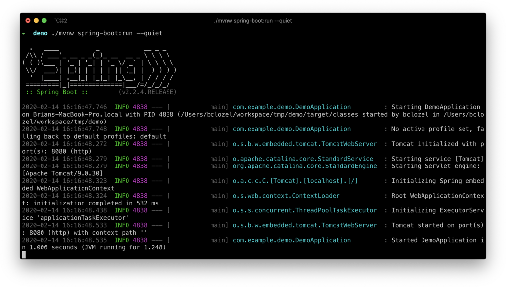
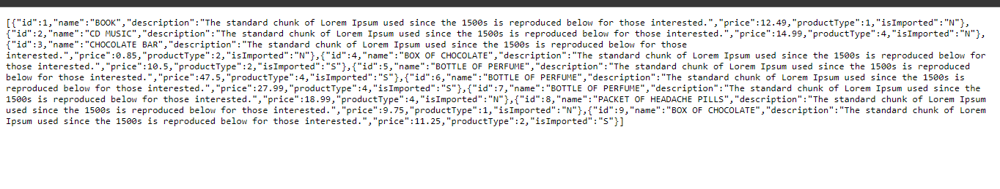

# Sale-Taxes API

Projeto desenvolvido utilizando as tecnologias:
* Spring Boot
* Flyway
* H2 Embedded Database
* Lombok
* Mockito

A arquitetura do backend foi feita com base na `MVVP`, facilicando o desenvolvimento e os testes, separando cada package como um módulo.

## 💻 Pré-requisitos

Antes de começar, verifique se você atendeu aos seguintes requisitos:
* Você instalou a versão mais recente de `JDK11 ou OpenJDK11`.
* Você tem o `maven` instalado.

## 🚀 Instalando Sale-Taxes API

Para instalar o sale-taxes-api, siga estas etapas:

```
git clone https://github.com/HenriqueDreyer/sale-taxes-api.git
```

Após baixar o projeto do repositório, ir no diretório em que o projeto foi baixado e executar o comando:

```
mvn clean install
```

## ☕ Usando

Abra uma linha de comando (ou terminal) e navegue até a pasta onde você tem os arquivos do projeto. Podemos construir e executar o aplicativo emitindo o seguinte comando:

MacOS/Linux:

```
./mvnw spring-boot:run
```

Windows:

```
mvnw spring-boot:run
```


As últimas linhas aqui nos dizem que o Spring começou. 

O servidor Apache Tomcat incorporado do Spring Boot está agindo como um servidor da web e ouvindo solicitações na porta localhost 8080. 

Abra seu navegador e na barra de endereço no topo digite:
```
http://localhost:8080/api/products/filter
```

Você deve obter uma boa resposta amigável como esta:


